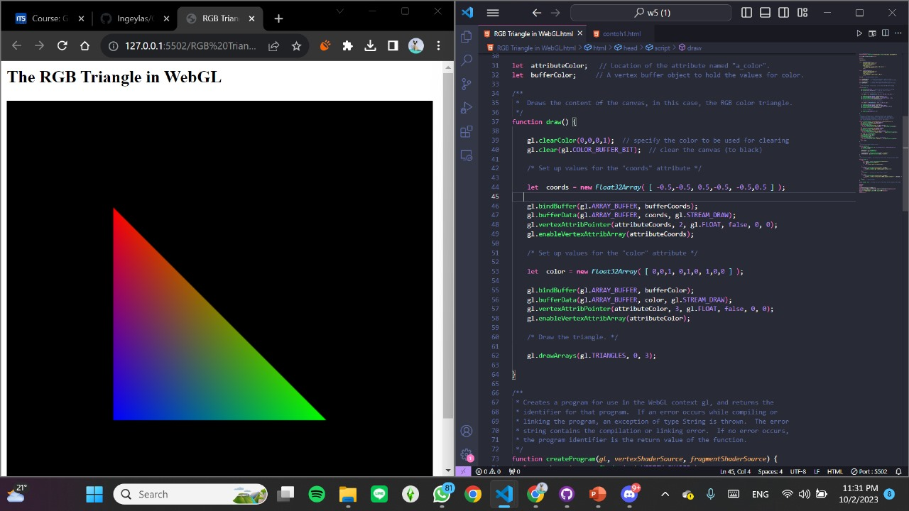
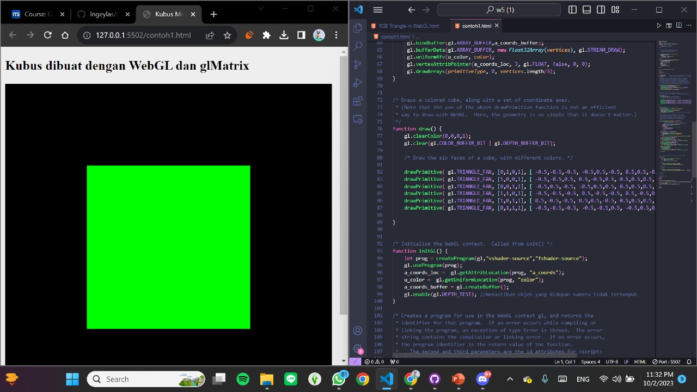
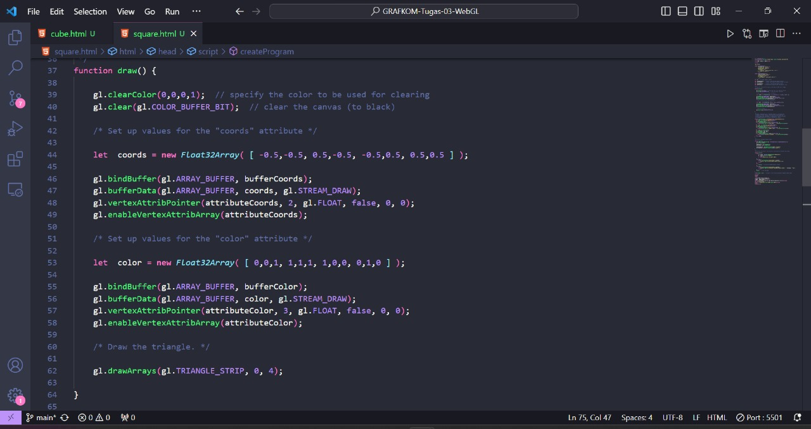
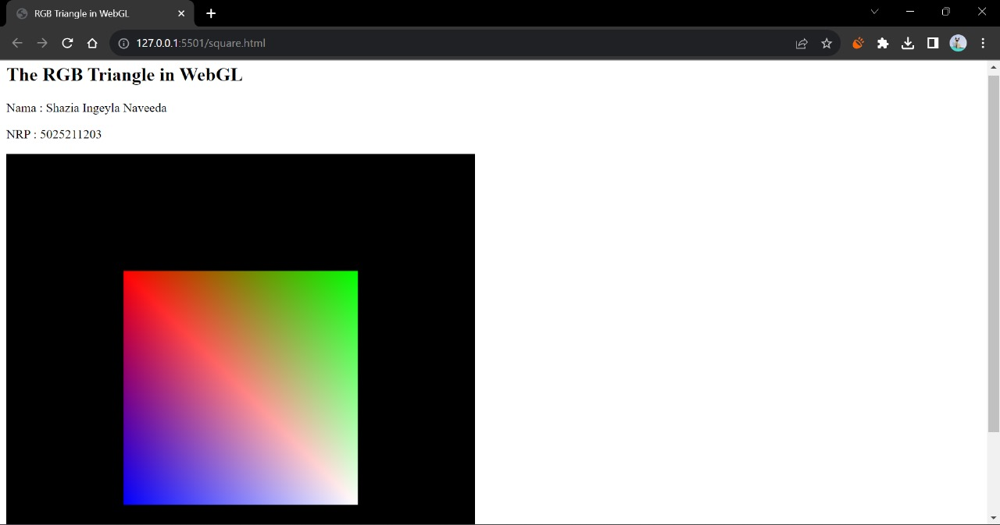
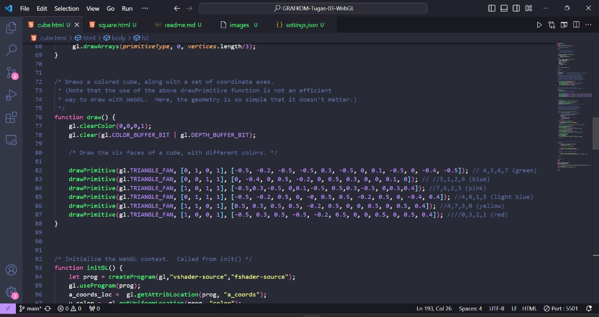
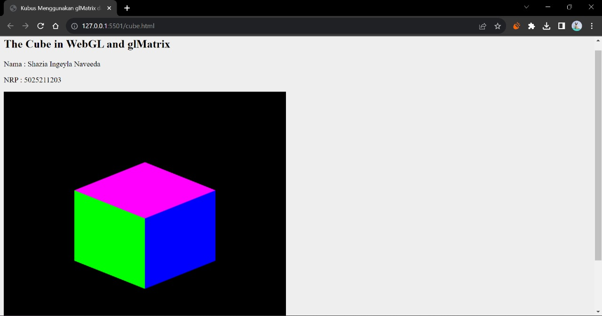

# Laporan Tugas WebGL
Name : Shazia Ingeyla Naveeda  
NRP : 5025211203

### Problem
- Drawing a 2-D square

- Show another side of the 3-D cube

### Code Modification and Output
- Drawing a 2-D square  
**Code Modification**

**Output**

- Show another side of the 3-D cube  
**Code Modification**

**Output**

